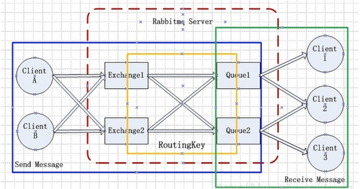

# 一. 常识
#### 1. 依赖注入有三种方式：
（1）变量（filed）注入；（2）构造器注入；（3）set方法注入  
先各自看一下实现方式  
##### 1.1 变量（filed）注入 @Autowired

    @Autowired
    UserDao userDao;
    
##### 1.2 构造器注入
    
    UserDao userDao;

    @Autowired
    public UserServiceImpl(UserDao userDao) {
        this.userDao = userDao;
    }

##### 1.3 set方法注入

    private UserDao userDao;

    @Autowired
    public void setUserDao (UserDao userDao) {
        this.userDao = userDao;
    }

优点：@Autowired：方式注入非常简洁，没有任何多余代码，非常有效的提高了java的简洁性。即使再多几个依赖一样能解决掉这个问题。

对比：  
（1）@Autowired：方式注入非常简洁，没有任何多余代码，非常有效的提高了java的简洁性。
但不能有效的指明依赖。相信很多人都遇见过一个bug，依赖注入的对象为null，
在启动依赖容器时遇到这个问题都是配置的依赖注入少了一个注解什么的，然而这种方式就过于依赖注入容器了，
当没有启动整个依赖容器时，这个类就不能运转，在反射时无法提供这个类需要的依赖。  
（2）set方式：这是一种选择注入，可有可无，即使没有注入这个依赖，那么也不会影响整个类的运行。  
（3）构造器方式：已经显式注明必须强制注入。通过强制指明依赖注入来保证这个类的运行。  

##### 1.4 @Qualifier(value = "beanName") and @Autowired 两个配合，等价于 @Resource(name="beanName")

#### 2. new ArrayList<>() 创建 随即 初始化 —— 示例
 （1）new ArrayList<String>(){{add("str01"); add("str02");}};  
 （2）new ArrayList<SimpleGrantedAuthority>(){{add(new SimpleGrantedAuthority("GROUP_admin"));}};  

#### 3. 同一主 boot工程 parent's pom.xml下的 多个子工程（微服务），当工程目录（包路径一致时，共用同一份 resources 配置资源文件）
例如：
schedule-server工程com.doctor.assistant.scheduleserver
tools-server工程com.doctor.assistant.scheduleserver
共用 schedule-server 的配置文件 

#### 4. RabbitMQ 绑定（binding）详细介绍
Exchange和Exchange、Queue之间的虚拟连接， Binding中可以包含Routing key或者参数  
  
default Exchange 不能进行Binding，也不需要进行绑定  

除default Exchange之外，其他任何Exchange都需要和Queue进行Binding，否则无法进行消息路由（转发）  

Binding的时候，可以设置一个或多个参数，其中参数要特别注意参数类型  

Direct Exchange、Topic Exchange进行Binding的时候，需要指定Routing key  

Fanout Exchange、Headers Exchange进行Binding的时候，不需要指定Routing key  

作者：时之令 
链接：https://www.jianshu.com/p/c176969ad0c1 
来源：简书 
著作权归作者所有。商业转载请联系作者获得授权，非商业转载请注明出处。

#### 5. 下一个常识 —— 虚位
